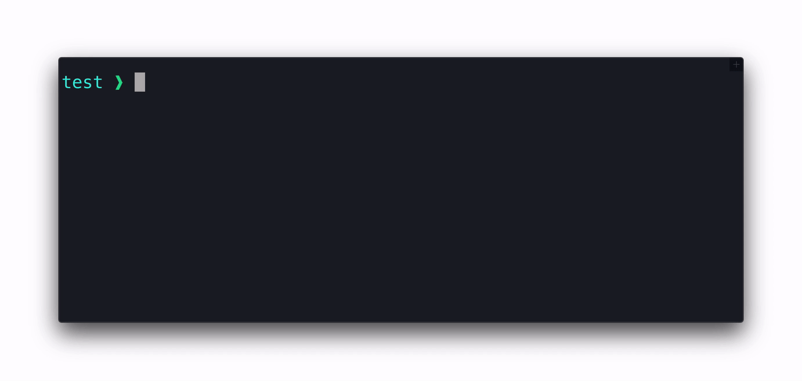

# Embler

Turn binaries into applications.

Embler can be used with `pkg` turn a Node.js project into an app, without having to resort to Electron. Useful for making a web interface, or a basic menubar app.

Supports macOS `app`, `dmg`, `zip` and `tar.gz`. `dmg` requires macOS



## Installation
```
npm install embler
```

## Usage
1. Specify options in your `package.json` like so:
    ```js
    {
        "name": "affinity-photo",
        "author": "Serif",
        "version": "1.7.0",
        "scripts": {
            "build": "embler",
        },
        "embler": {
            "realName": "Affinity Photo",
            "appId": "com.seriflabs.affinityphoto",
            "mac": {
                "binary": "dist/affinity-photo-mac-bin",
                "icon": "icon.png",
                "formats": ["app", "dmg", "zip", "tar.gz"],
            }
        }
    }
    ```
2. Run `npm run build`

### Usage with `pkg`
1. Run `npm install pkg`
2. Configure `pkg` and `embler` to your liking (Usage example above)
2. Set the `scripts.build`, `bin` and `embler.mac.binary` properties in your `package.json` like so:
```js
{
    "bin": "index.js",
    "scripts": {
        "build": "pkg . --target macos --output dist/test-bin-macos && embler"
    },
    "embler": {
        "mac": {
            "binary": "dist/test-bin-macos"
        }
    }
}
```
3. Run `npm run build`
4. `index.js` is now an app.


### API Usage

Supply options via `json` file:

```js
const embler = require('embler')
await embler.build('embler.json')
```

Supply options directly:
```js
const embler = require('embler')
await embler.build({
    name: "my-app",
    author: "kasper.space",
    version: "2.4.1",
    embler: {
        realName: "My App",
        // ...
    }
})
```

## Options

### `name`
- **Required unless `embler.name` is specified**
- The app's name. For example used for the app's process name
- Recommended to not use spaces or non-basic special characters

### `author`
- **Required unless `embler.author` is specified**
- The app's author

### `version`
- **Required unless `embler.version` is specified**
- The version of the app

### `embler.realName` = `"${name}"`
- *Recommended*
- The app's name. This is the name users will see
- Spaces and special characters are allowed in this one

### `embler.appId` = `"com.example.${name}"`
- *Recommended*
- The application id

### `embler.copyright` = `"Copyright © year ${author}"`
- Human-readable copyright line

### `embler.outputDir` = `"dist"`
- The output folder

### `embler.backgroundApp` = `false`
- Whether the app will just run in the background app. On macOS, it won't show up in the Dock

### `embler.name`
- Overrides `name`

### `embler.author`
- Overrides `author`

### `embler.version`
- Overrides `version`

### `embler.mac`
- Object which contains macOS-specific options

#### `embler.mac.binary`
- **Required**
- Path to the binary which will run when the app is opened

#### `embler.mac.category`
- *Recommended*
- The app's category. Shown in `/Applications` in Finder when `View > Use Groups` is enabled using `View > Sort By > Application Category`
- Valid categories are listed in [Apple's documentation](https://developer.apple.com/library/archive/documentation/General/Reference/InfoPlistKeyReference/Articles/LaunchServicesKeys.html#//apple_ref/doc/uid/TP40009250-SW8)

#### `embler.mac.icon`
- *Recommended*
- Path to your app's icon
- `.icns` or `.png`

#### `embler.mac.formats` = `["app"]`
- Array of the formats Pakaer will output
- Supports `app`, `dmg`, `zip` and `tar.gz`. Creating `dmg` requires macOS

#### `embler.mac.dmgBackground`
- Path to a custom background image for the `dmg`
- The resolution should be 660x400
- To support retina displays, have an extra image at double resolution that ends with `@2x`. For example, you could have `dmgbg.png` and `dmgbg@2x.png`

#### `embler.mac.darkModeSupport` = `true`
- Turn this to false to disable dark mode support.

#### `embler.mac.customInfo` = `{}`
- In this object, you may add or overwrite `Info.plist` entries. Example:
    ```js
    "customInfo": {
        "CFBundleDevelopmentRegion": "en"
    }
    ```

### Dev Instructions

### Get started
1. Install Node.js
2. Run `npm install`
3. Set up ESLint support for your code editor

To be able to run/test Embler:
4. Go to `./test` (This is where you test Embler)
5. Run `npm install`
6. Run `npm run compile` (Compiles `index.js` to binary)

To test Embler:
```
cd ./test
npm run pack
```

### Publish new version
1. Update CHANGELOG.md
2. Bump the version number, commit and tag:
    ```
    npm version <version>
    ```
5. Publish to npm:
    ```
    npm publish
    ```
6. Create GitHub release with release notes
